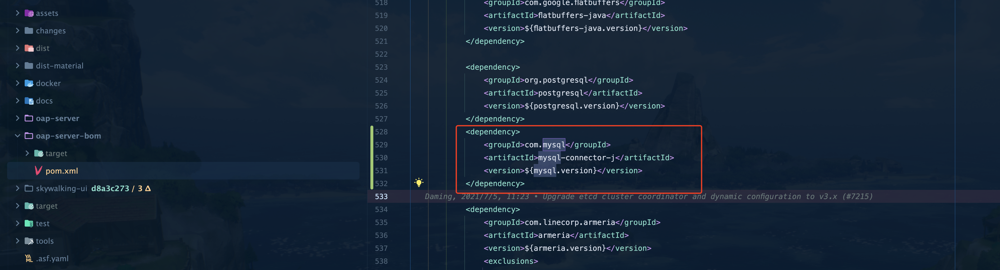
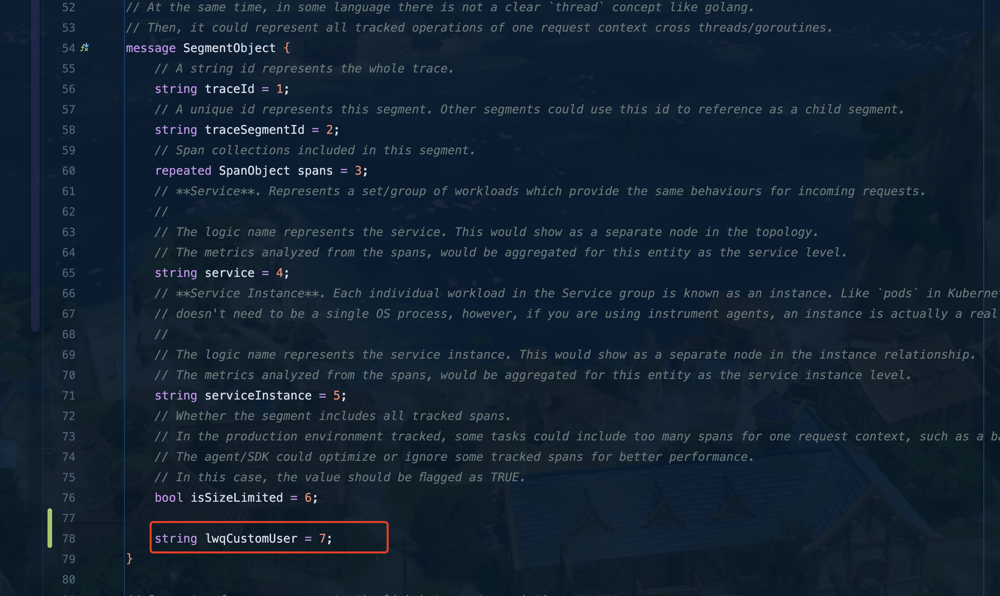
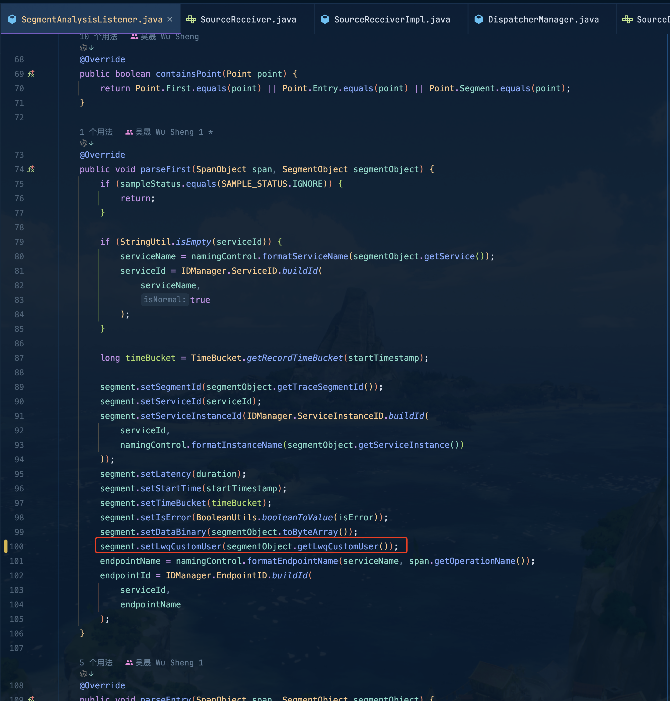
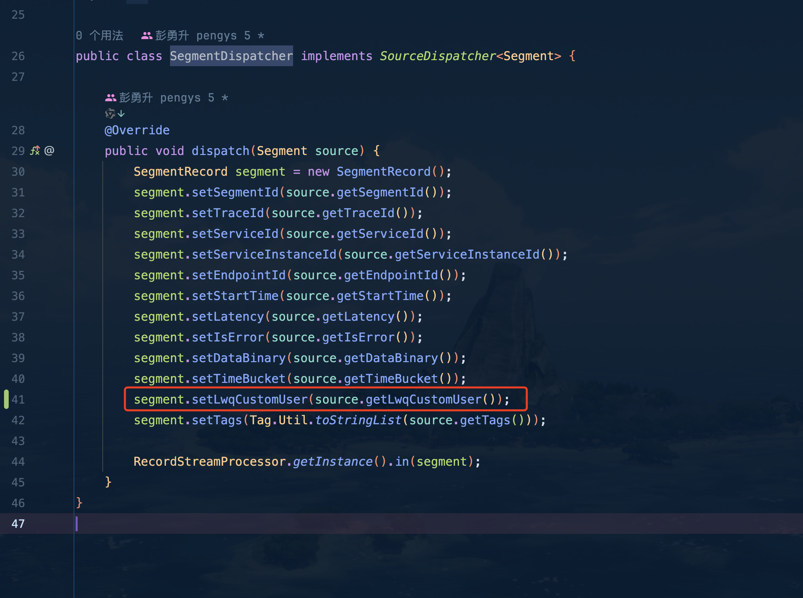
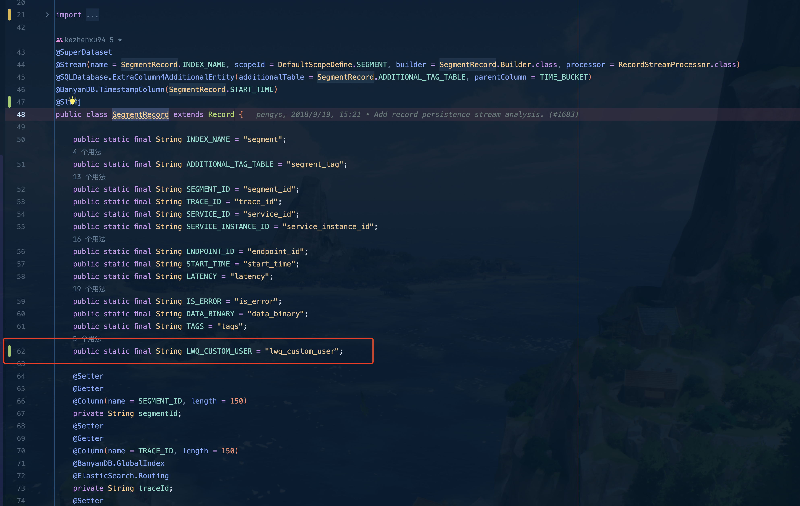
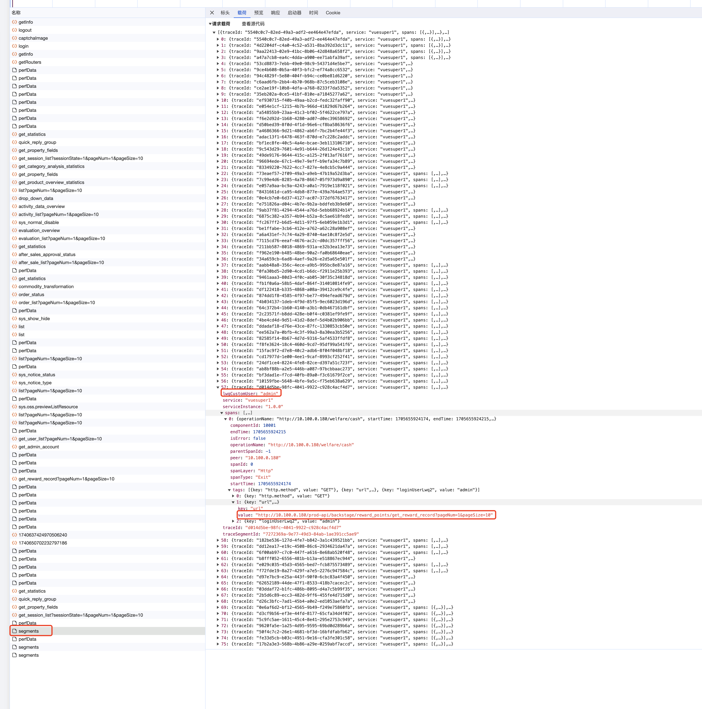
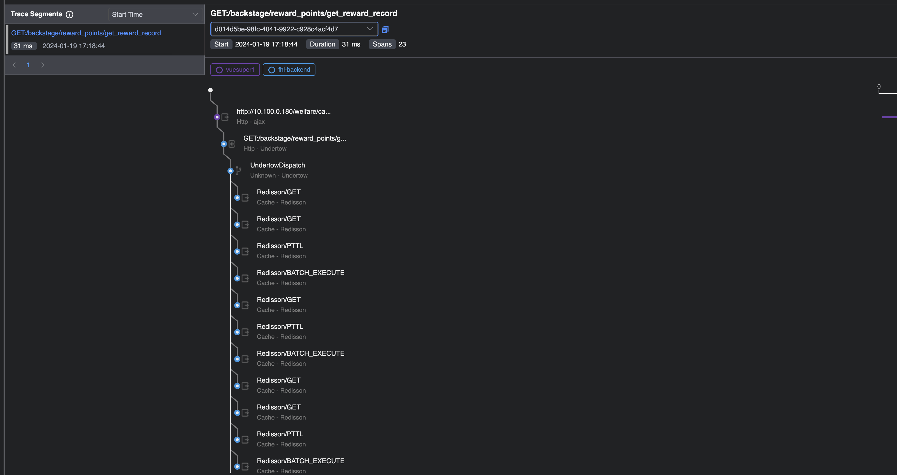
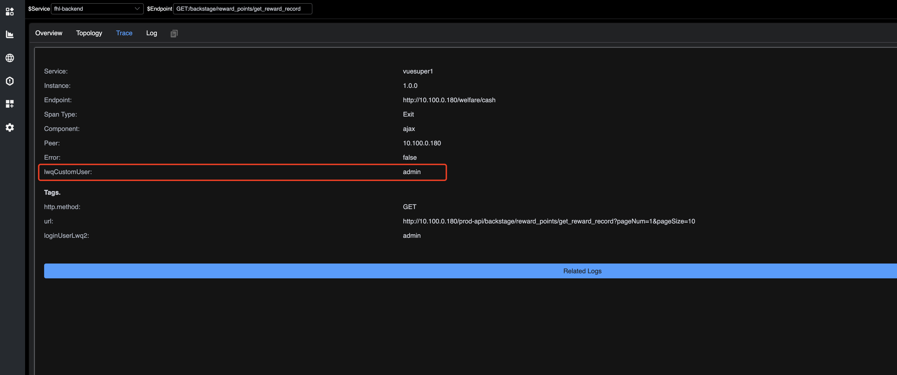

## 使用心得

### 1、关于编译

就算有报错也编译不用怕，就是有些插件本身就用不到而已

克隆代码

```shell
git clone https://github.com/apache/skywalking.git
```

注意要初始化子模块，Skywalking的网络模块就是一个子模块，如果直接编译会报错

```shell
git submodule init
git submodule update
```

关于代码中有中文编译不过，可以将这个插件禁用即可


### 2、数据库

关于Skywalking的数据库文件，是没有的他们是直接在服务启动时直接创建数据表结构的，且是按照天对数据进行分区的。

关于如果你的Skywalking存储服务选择的是mysql，那么需要注意了，因为开源协议许可的问题，Skywalking不能直接将mysql驱动添加到项目中，所以如果需要，则自行对其进行引入



```xml
            <dependency>
                <groupId>com.mysql</groupId>
                <artifactId>mysql-connector-j</artifactId>
                <version>${mysql.version}</version>
            </dependency>
```


```xml
<dependency>
    <groupId>com.mysql</groupId>
    <artifactId>mysql-connector-j</artifactId>
</dependency>
```

### 3、针对适配浏览器监控用户信息

有前端通过该http接口将用户信息提交到Skywalking，我需要将其进行集成。

/v3/segments

达到的效果，前端页面会传递登录用户名称，而Skywalking需要对其进行存储，在Skywalking能看到该用户名称

接口位置：org.apache.skywalking.oap.server.receiver.trace.provider.handler.v8.rest.TraceSegmentReportHandler


首先要对SegmentObject类进行改造，前端传递过来的信息，由该对象进行接收。

先与前端约定好需要新增的字段名称。

前端需新增字段：lwqCustomUser，数据类型：字符串

SegmentObject对象是由grpc序列化协议proto3进行编写的。

类路径：apm-protocol/apm-network/src/main/proto/language-agent/Tracing.proto:54

需新增：



这样Skywalking就能接收前端传递的新增字段了，对于修改Tracing.proto文件需要重新编译才能生效。

对org.apache.skywalking.oap.server.analyzer.provider.trace.parser.listener.SegmentAnalysisListener需要新增set



对org.apache.skywalking.oap.server.core.analysis.manual.segment.SegmentDispatcher需新增set



注意此类对应数据表结构

org.apache.skywalking.oap.server.core.analysis.manual.segment.SegmentRecord

在此新增数据表列，存储前段新增字段数据




为了让前端能看见该参数还需更改如下

因为前端请求是graphql，所以需要先修改对应的graphql对应的实体类

trace.graphqls


对应的需要修改org.apache.skywalking.oap.server.core.query.type.Span


修改DAO文件org.apache.skywalking.oap.server.storage.plugin.jdbc.common.dao.JDBCTraceQueryDAO

修改查询的sql语句拼接


对于查询结果需要对数据进行解析


组合span数据时需要设置值org.apache.skywalking.oap.server.core.query.TraceQueryService


因为要在前端展示新增的字段所以需要修改：skywalking-ui/src/graphql/fragments/trace.ts

查询语句：


修改页面上展示的位置：skywalking-ui/src/views/dashboard/related/trace/components/D3Graph/SpanDetail.vue


适配之后的效果展示

前端登录用户是admin、访问地址：http://10.100.0.180/prod-api/backstage/reward_points/get_reward_record?pageNum=1&pageSize=10



SkywalkingUI展示：



新增字段

